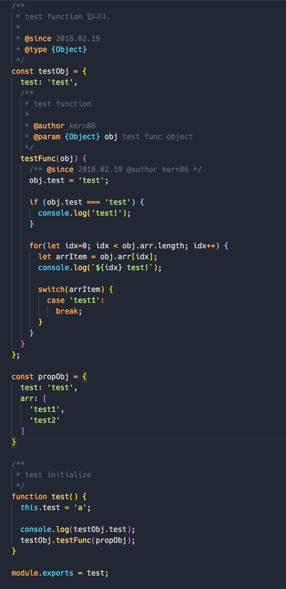

# Visual Studio Code - Extensions

* [Marketplace](https://marketplace.visualstudio.com/VSCode)

## Table of Contents

* [Bookmarks](#Bookmarks)
* [Bracket Pair Colorizer](#BracketPiarColorizer)

---

### Bookmarks

https://marketplace.visualstudio.com/items?itemName=alefragnani.Bookmarks

#### 기능

편집기에서 행을 표시하고 쉽게 이동 하거나 표시된 마크 사이의 텍스트 선택을 쉽게 할 수 있습니다.

#### Shortcuts

북마크 키 바인딩 목록입니다.

| Key | Command | Command id |
| --- | --- | --- |
| ⌥⌘K | Toggle | `bookmarks.toggle` |
| ⌥⌘L | Jump to Next | `bookmarks.jumpToNex` |
| ⌥⌘J | Jump to Previous | `bookmarks.jumpToPrevious` |
| ⇧⌥K | Shrink Selection | `bookmarks.shrinkSelection` |
| ⇧⌥L | Expand Selection to Next | `bookmarks.expandSelectionToNext` |
| ⇧⌥J | Expand Selection to Previous | `bookmarks.expandSelectionToPrevious` |
| | Clear | `bookmarks.clear` |
| | Clear from All Files | `bookmarks.clearFromAllFiles` |
| | Clear from File | `bookmarks.clearFromFile` |
| | Delete Bookmark | `bookmarks.deleteBookmark` |
| | Jump to Document/Line | `bookmarks.jumpTo` |
| | List | `bookmarks.list` |
| | List from All Files | `bookmarks.listFromAllFiles` |
| | Refresh | `bookmarks.refresh` |
| | Select Lines (Selection) | `bookmarks.selectLines` |

----
### BracketPiarColorizer

https://marketplace.visualstudio.com/items?itemName=CoenraadS.bracket-pair-colorizer

#### 기능
* editor에 모든 bracket들 (괄호, 대괄호 등등 모두 전부요!)에 쌍으로 colorize 시키는 extension입니다.
* 처음엔 적응하기 힘들지 몰라도 적응하면 가독성이 훨씬 좋아집니다!
* light theme에는 별도로 색을 다시 정의해야하는 단점이.. 있습니다. (안보입니다 ㅜㅜ)

#### screenshot

