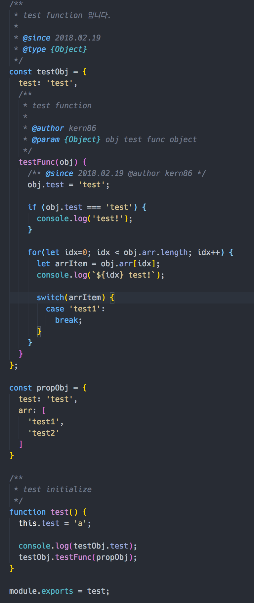
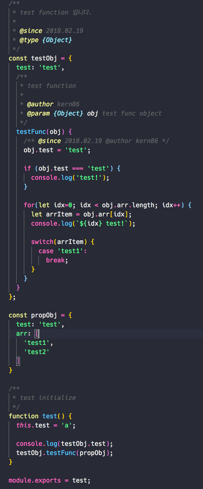
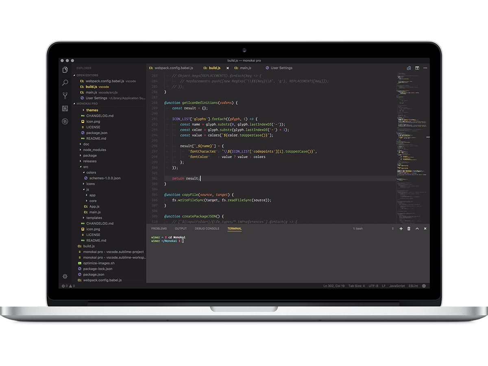

# vscode themes

## 개요
테마에 강박증이 있어 자주 바꾸는 편인데, 쓰던 테마중 괜찮았던 테마들을 리스트업 하고자 해당 문서를 작성합니다.

## Dark Themes

### 1) Ayu
* 개인적으로 색조합이 무난한 테마라고 생각합니다.
* dark 모드 및 Mirage, Light 모드가 포함되어 있습니다.
* dark보다는 Mirage 모드를 선호합니다.
* Object syntax에 있어서 property를 표현하지 못하는 점이 부족한 점으로 보입니다.

*ScreenShot*

### 2) Dracula
* official에서 유명한 dracula 테마입니다.
* Object 표현은 ayu와 동일합니다. (vscode 테마들에서 가장 아쉬운 부분들입니다...)

*ScreenShot*

### 3) Kary
* object syntax가 잘 적용되어 있는 테마가 없는지 검색하던 중에 발견한 테마입니다.
* 전체적으로는 파스텔톤이긴 하나, object 관련하여 property 표현이 바로 되어있어서 한동안 계속 사용했던 테마중 하나입니다.

*ScreenShot*

### 4) One Monokai 80s
* 이것도.. monokai에서 object 표현이 되는 테마가 있는지 해서 찾아보다가 발견한 테마입니다.
* 옛날 80년대 색상처럼 monokai 80s입니다.

*ScreenShot*

### 5) Snazzy theme
* 주로 iterm이나 hyperterm에서 사용되는 테마들을 찾아서 사용해보곤 하는데, 이테마도 iterm 또는 hyperterm에서 보고 찾은 테마입니다.
* 나중에 iterm 쪽 테마도 한번 찾아서 적용해보시면 좋을 듯 합니다.

### 6) Monokai Pro
* monokai의 변종으로 보이는데, syntax 컬러가 나쁘지 않습니다.
* 역시나 reactjs syntax는 완벽하지 않은 느낌입니다. typescript syntax로 지정하여 사용하는 것을 추천합니다.

